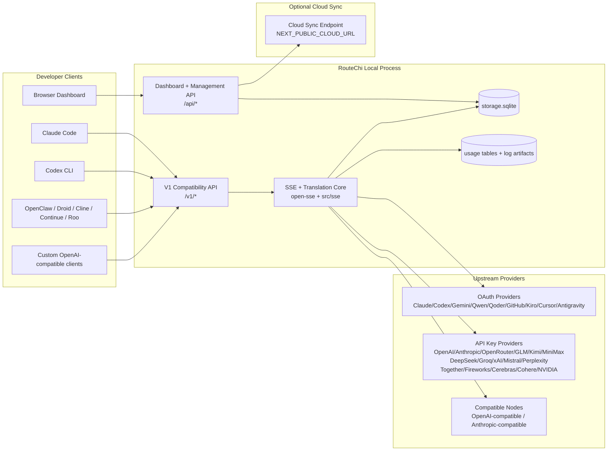
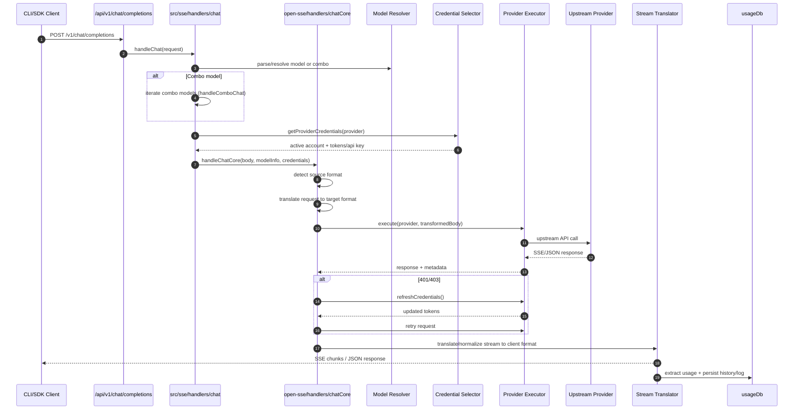
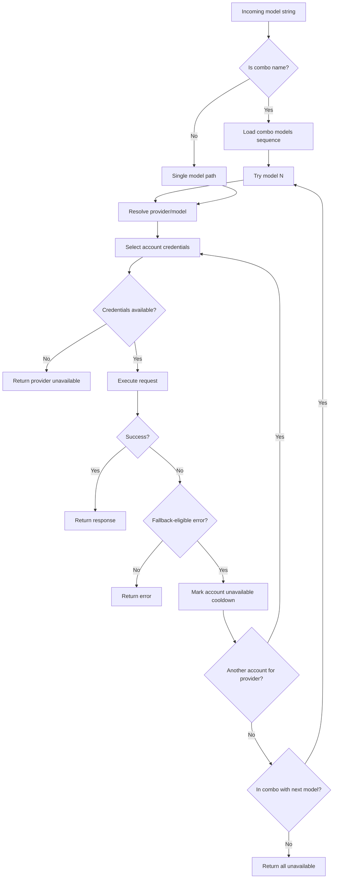
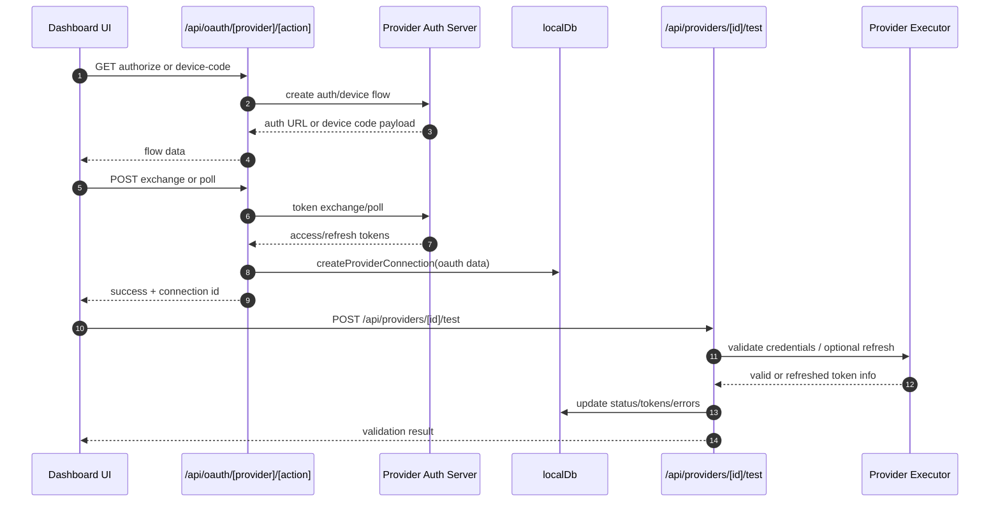
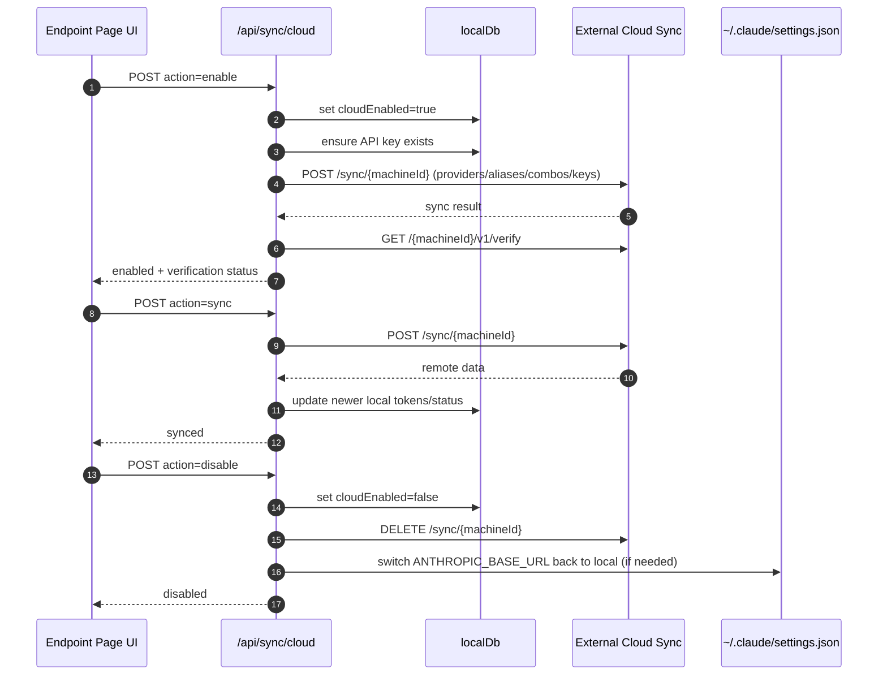
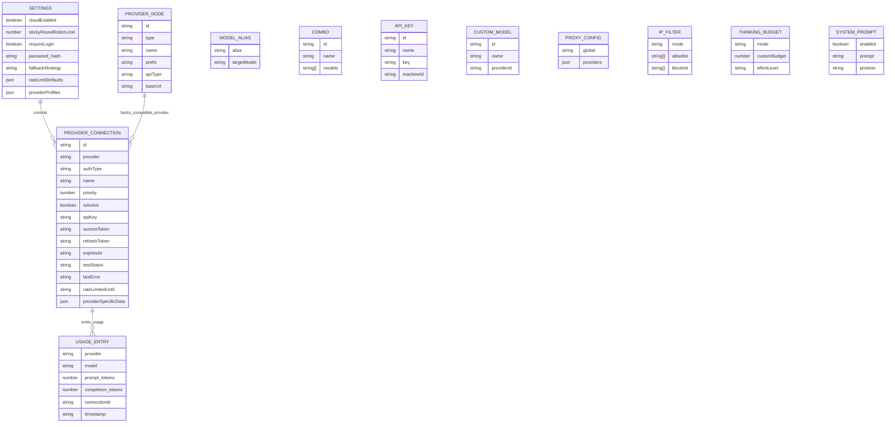
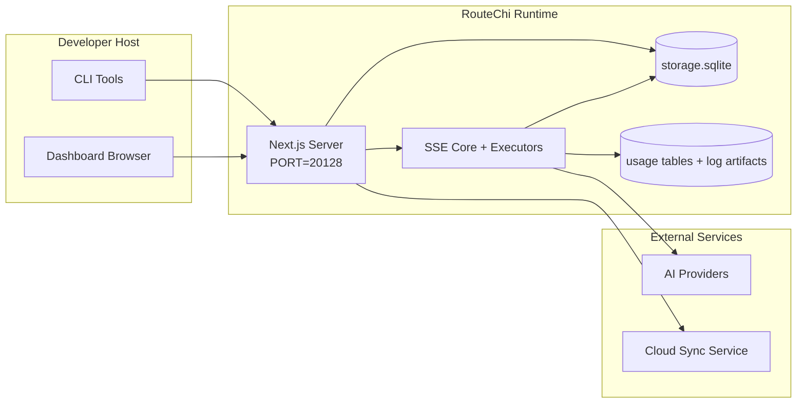

# معماری RouteChi

🌐 **زبان‌ها:** 🇺🇸 [English](./ARCHITECTURE.md) | 🇧🇷 [Português (Brasil)](../i18n/pt-BR/docs/architecture/ARCHITECTURE.md) | 🇪🇸 [Español](../i18n/es/docs/architecture/ARCHITECTURE.md) | 🇫🇷 [Français](../i18n/fr/docs/architecture/ARCHITECTURE.md) | 🇮🇹 [Italiano](../i18n/it/docs/architecture/ARCHITECTURE.md) | 🇷🇺 [Русский](../i18n/ru/docs/architecture/ARCHITECTURE.md) | 🇨🇳 [中文 (简体)](../i18n/zh-CN/docs/architecture/ARCHITECTURE.md) | 🇩🇪 [Deutsch](../i18n/de/docs/architecture/ARCHITECTURE.md) | 🇮🇳 [हिन्दी](../i18n/in/docs/architecture/ARCHITECTURE.md) | 🇹🇭 [ไทย](../i18n/th/docs/architecture/ARCHITECTURE.md) | 🇺🇦 [Українська](../i18n/uk-UA/docs/architecture/ARCHITECTURE.md) | 🇸🇦 [العربية](../i18n/ar/docs/architecture/ARCHITECTURE.md) | 🇯🇵 [日本語](../i18n/ja/docs/architecture/ARCHITECTURE.md) | 🇻🇳 [Tiếng Việt](../i18n/vi/docs/architecture/ARCHITECTURE.md) | 🇧🇬 [Български](../i18n/bg/docs/architecture/ARCHITECTURE.md) | 🇩🇰 [Dansk](../i18n/da/docs/architecture/ARCHITECTURE.md) | 🇫🇮 [Suomi](../i18n/fi/docs/architecture/ARCHITECTURE.md) | 🇮🇱 [עברית](../i18n/he/docs/architecture/ARCHITECTURE.md) | 🇭🇺 [Magyar](../i18n/hu/docs/architecture/ARCHITECTURE.md) | 🇮🇩 [Bahasa Indonesia](../i18n/id/docs/architecture/ARCHITECTURE.md) | 🇰🇷 [한국어](../i18n/ko/docs/architecture/ARCHITECTURE.md) | 🇲🇾 [Bahasa Melayu](../i18n/ms/docs/architecture/ARCHITECTURE.md) | 🇳🇱 [Nederlands](../i18n/nl/docs/architecture/ARCHITECTURE.md) | 🇳🇴 [Norsk](../i18n/no/docs/architecture/ARCHITECTURE.md) | 🇵🇹 [Português (Portugal)](../i18n/pt/docs/architecture/ARCHITECTURE.md) | 🇷🇴 [Română](../i18n/ro/docs/architecture/ARCHITECTURE.md) | 🇵🇱 [Polski](../i18n/pl/docs/architecture/ARCHITECTURE.md) | 🇸🇰 [Slovenčina](../i18n/sk/docs/architecture/ARCHITECTURE.md) | 🇸🇪 [Svenska](../i18n/sv/docs/architecture/ARCHITECTURE.md) | 🇵🇭 [Filipino](../i18n/phi/docs/architecture/ARCHITECTURE.md) | 🇨🇿 [Čeština](../i18n/cs/docs/architecture/ARCHITECTURE.md)

_آخرین به‌روزرسانی: 2026-06-28_

## خلاصه اجرایی

RouteChi یک gateway و داشبورد محلی مسیریابی AI است که بر بستر Next.js ساخته شده است.
یک endpoint منفرد سازگار با OpenAI (`/v1/*`) فراهم می‌کند و ترافیک را در میان چندین provider بالادستی با ترجمه، fallback، refresh token و ردیابی استفاده مسیریابی می‌کند.

قابلیت‌های اصلی:

- سطح API سازگار با OpenAI برای CLI/ابزارها (۲۳۷ provider، ۷۵ executor)
- ترجمه درخواست/پاسخ در میان فرمت‌های provider
- fallback combo مدل (توالی چندمدلی)
- مراحل combo ساختاریافته (`provider + model + connection`) با ترتیب‌بندی runtime با `compositeTiers`
- fallback سطح-حساب (چندحسابی به‌ازای هر provider)
- preflight سهمیه و انتخاب حساب P2C آگاه-از-سهمیه در مسیر chat اصلی
- مدیریت اتصال provider با OAuth + API-key (۱۹ ماژول provider OAuth)
- تولید embedding از طریق `/v1/embeddings` (۶ provider، ۹ مدل)
- تولید تصویر از طریق `/v1/images/generations` (۱۰+ provider، ۲۰+ مدل)
- رونویسی صدا از طریق `/v1/audio/transcriptions` (۷ provider)
- متن‌به‌گفتار از طریق `/v1/audio/speech` (۱۰ provider)
- تولید ویدئو از طریق `/v1/videos/generations` (ComfyUI + SD WebUI)
- تولید موسیقی از طریق `/v1/music/generations` (ComfyUI)
- جست‌وجوی وب از طریق `/v1/search` (۵ provider)
- Moderation از طریق `/v1/moderations`
- Reranking از طریق `/v1/rerank`
- تجزیه تگ think (`<think>...</think>`) برای مدل‌های استدلالی
- sanitize پاسخ برای سازگاری سخت SDK OpenAI
- نرمال‌سازی نقش (developer→system، system→user) برای سازگاری بین-provider
- تبدیل خروجی ساختاریافته (json_schema → Gemini responseSchema)
- پایا‌سازی محلی برای provider‌ها، کلیدها، alias‌ها، combo‌ها، تنظیمات، قیمت‌گذاری (۲۶ ماژول DB)
- ردیابی استفاده/هزینه و ثبت درخواست
- cloud sync اختیاری برای همگام‌سازی چند device/state
- allowlist/blocklist IP برای کنترل دسترسی API
- مدیریت بودجه thinking (passthrough/auto/custom/adaptive)
- تزریق system prompt سراسری
- ردیابی و fingerprint نشست
- محدودیت نرخ بهبودیافته به‌ازای-حساب با پروفایل‌های خاص provider
- الگوی مدارشکنی برای تاب‌آوری provider
- حفاظت ضد thundering herd با mutex locking
- cache تکرار درخواست مبتنی‌بر-امضا
- لایه domain: قواعد هزینه، سیاست fallback، سیاست lockout
- Context Relay: خلاصه‌های تحویل نشست برای تداوم چرخش حساب
- پایا‌سازی حالت domain (cache write-through در SQLite برای fallback‌ها، بودجه‌ها، lockout‌ها، مدارشکن‌ها)
- موتور سیاست برای ارزیابی متمرکز درخواست (lockout ← بودجه ← fallback)
- تلمتری درخواست با تجمیع تأخیر p50/p95/p99
- تلمتری هدف combo و سلامت تاریخی هدف combo از طریق `combo_execution_key` / `combo_step_id`
- correlation ID (X-Request-Id) برای ردیابی end-to-end
- ثبت ممیزی انطباق با opt-out به‌ازای کلید API
- چارچوب ارزیابی برای تضمین کیفیت LLM
- داشبورد سلامت با وضعیت مدارشکنی provider در زمان واقعی
- سرور MCP (۸۷ ابزار) با ۳ transport (stdio/SSE/Streamable HTTP)
- سرور A2A (JSON-RPC 2.0 + SSE) با skill‌ها و چرخه حیات وظیفه
- سیستم حافظه (استخراج، تزریق، بازیابی، خلاصه‌سازی)
- سیستم Skills (رجیستری، executor، sandbox، skill‌های built-in)
- پروکسی MITM با مدیریت گواهی و مدیریت DNS
- میان‌افزار حفاظ تزریق prompt
- خط لوله فشرده‌سازی prompt با Caveman، RTK، خط لوله‌های stacked، combo‌های فشرده‌سازی، بسته‌های زبان، و analytics
- رجیستری ACP (Agent Communication Protocol)
- provider‌های OAuth ماژولار (۱۹ ماژول فردی زیر `src/lib/oauth/providers/`)
- اسکریپت‌های uninstall/full-uninstall
- اقدام تعمیر محیط OAuth
- پل WebSocket برای کلاینت‌های WS سازگار با OpenAI (`/v1/ws`)
- مدیریت sync token (صدور/ابطال، دانلود bundle پیکربندی نسخه‌بندی‌شده-ETag)
- preset provider اولیه GLM Thinking (`glmt`)
- شمارش توکن ترکیبی (سمت provider `/messages/count_tokens` با fallback تخمینی)
- auto-seeding alias مدل (۳۰+ نرمال‌سازی گویش cross-proxy در راه‌اندازی)
- fetch خروجی امن با حفاظ SSRF، مسدودسازی URL خصوصی، و retry قابل‌پیکربندی
- retryهای chat آگاه-از-cooldown با `requestRetry` و `maxRetryIntervalSec` قابل‌پیکربندی
- اعتبارسنجی محیط runtime با Zod در راه‌اندازی
- ممیزی انطباق v2 با pagination، رویدادهای CRUD provider، و ثبت اعتبارسنجی SSRF-blocked

مدل runtime اصلی:

- مسیرهای اپ Next.js زیر `src/app/api/*` هم API‌های داشبورد و هم API‌های سازگار را پیاده‌سازی می‌کنند
- یک core مشترک SSE/مسیریابی در `src/sse/*` + `open-sse/*` اجرای provider، ترجمه، streaming، fallback و استفاده را مدیریت می‌کند

## نمودارهای مرجع

منابع Mermaid کانونی، کنترل‌شده با نسخه برای پلتفرم v3.8.0 در
[`docs/diagrams/`](../diagrams/README.md) قرار دارند. دو نمودار برای جهت‌گیری در زیر بازتولید شده‌اند؛
بقیه از راهنماهای اختصاصی دامنه آن‌ها لینک شده‌اند.


> منبع: [diagrams/request-pipeline.mmd](../diagrams/request-pipeline.mmd)


> منبع: [diagrams/resilience-3layers.mmd](../diagrams/resilience-3layers.mmd) — همچنین از
> [RESILIENCE_GUIDE.md](./RESILIENCE_GUIDE.md) و مرجع تاب‌آوری `CLAUDE.md` لینک شده است.

## دامنه و مرزها

### درون دامنه

- runtime gateway محلی
- API‌های مدیریت داشبورد
- احراز هویت provider و refresh token
- ترجمه درخواست و streaming SSE
- پایا‌سازی حالت محلی + استفاده
- هماهنگی cloud sync اختیاری

### خارج از دامنه

- پیاده‌سازی سرویس cloud پشت `NEXT_PUBLIC_CLOUD_URL`
- SLA/control plane provider خارج از فرآیند محلی
- خود باینری‌های CLI خارجی (Claude CLI، Codex CLI، و غیره)

## سطح داشبورد (فعلی)

صفحات اصلی زیر `src/app/(dashboard)/dashboard/`:

- `/dashboard` — شروع سریع + نمای کلی provider
- `/dashboard/endpoint` — پروکسی endpoint + MCP + A2A + تب‌های API endpoint
- `/dashboard/providers` — اتصالات provider و credential‌ها
- `/dashboard/combos` — استراتژی‌های combo، قالب‌ها، سازنده مبتنی‌بر-مرحله، قواعد مسیریابی مدل، ترتیب‌بندی manual persisted
- `/dashboard/auto-combo` — موتور Auto Combo: وزن‌های امتیازدهی، mode pack‌ها، presetهای virtual factory، تلمتری
- `/dashboard/costs` — تجمیع هزینه و دیدپذیری قیمت‌گذاری
- `/dashboard/analytics` — analytics استفاده، ارزیابی‌ها، سلامت هدف combo
- `/dashboard/limits` — کنترل‌های سهمیه/محدودیت نرخ
- `/dashboard/cli-tools` — onboarding CLI، شناسایی runtime، تولید پیکربندی
- `/dashboard/agents` — agent‌های ACP شناسایی‌شده + ثبت agent سفارشی
- `/dashboard/cloud-agents` — وظایف agent میزبانی‌شده در cloud (Codex Cloud، Devin، Jules) و چرخه حیات وظیفه
- `/dashboard/skills` — رجیستری skill A2A، اجرای sandbox، کاتالوگ skill built-in
- `/dashboard/memory` — بازرسی و بازیابی حافظه مکالمه پایا
- `/dashboard/webhooks` — اشتراک webhook خروجی، چرخش secret، آمار retry
- `/dashboard/batch` — ارسال وظیفه batch و پیشرفت
- `/dashboard/cache` — آمار cache read-through و reasoning، کنترل‌های eviction
- `/dashboard/playground` — playground chat تعاملی علیه هر combo/model پیکربندی‌شده
- `/dashboard/changelog` — نمایشگر changelog درون‌برنامه‌ای (renders `CHANGELOG.md`)
- `/dashboard/system` — تشخیص‌های runtime، اطلاعات نسخه، سطح اعتبارسنجی محیط
- `/dashboard/onboarding` — wizard راه‌اندازی اولین اجرا برای نصب‌های جدید
- `/dashboard/media` — playground تصویر/ویدئو/موسیقی
- `/dashboard/search-tools` — آزمایش provider جست‌وجو و تاریخچه
- `/dashboard/health` — uptime، مدارشکن‌ها، محدودیت‌های نرخ، نشست‌های پایش‌شده-سهمیه
- `/dashboard/logs` — گزارش‌های درخواست/پروکسی/ممیزی/کنسول
- `/dashboard/settings` — تب‌های تنظیمات سیستم (عمومی، مسیریابی، پیش‌فرض‌های combo، و غیره)
- `/dashboard/context/caveman` — قواعد فشرده‌سازی Caveman، بسته‌های زبان، پیش‌نمایش، و حالت خروجی
- `/dashboard/context/rtk` — فیلترهای خروجی فرمان RTK، پیش‌نمایش، و تنظیمات ایمنی runtime
- `/dashboard/context/combos` — خط لوله‌های فشرده‌سازی نام‌گذاری‌شده اختصاص‌یافته به combo‌های مسیریابی
- `/dashboard/translator` — بازرسی translator و پیش‌نمایش تبدیل فرمت درخواست
- `/dashboard/audit` — مرورگر گزارش ممیزی انطباق با pagination و metadata ساختاریافته
- `/dashboard/usage` — مرورگر استفاده به‌ازای-درخواست tied به `usage_history`
- `/dashboard/compression` — analytics فشرده‌سازی، آمار، و اختصاص خط لوله
- `/dashboard/api-manager` — چرخه حیات API key و مجوزهای مدل

## زمینه سیستم سطح‌بالا



## مؤلفه‌های Core Runtime

## ۱) لایه API و مسیریابی (مسیرهای اپ Next.js)

دایرکتوری‌های اصلی:

- `src/app/api/v1/*` و `src/app/api/v1beta/*` برای API‌های سازگار
- `src/app/api/*` برای API‌های management/پیکربندی
- rewrite‌های Next در `next.config.mjs` `/v1/*` را به `/api/v1/*` نگاشت می‌کنند

مسیرهای سازگار مهم:

- `src/app/api/v1/chat/completions/route.ts`
- `src/app/api/v1/messages/route.ts`
- `src/app/api/v1/responses/route.ts`
- `src/app/api/v1/models/route.ts` — شامل مدل‌های سفارشی با `custom: true`
- `src/app/api/v1/embeddings/route.ts` — تولید embedding (۶ provider)
- `src/app/api/v1/images/generations/route.ts` — تولید تصویر (۴+ provider از جمله Antigravity/Nebius)
- `src/app/api/v1/messages/count_tokens/route.ts`
- `src/app/api/v1/providers/[provider]/chat/completions/route.ts` — chat اختصاصی به‌ازای provider
- `src/app/api/v1/providers/[provider]/embeddings/route.ts` — embedding اختصاصی به‌ازای provider
- `src/app/api/v1/providers/[provider]/images/generations/route.ts` — تصاویر اختصاصی به‌ازای provider
- `src/app/api/v1beta/models/route.ts`
- `src/app/api/v1beta/models/[...path]/route.ts`

دامنه‌های مدیریت:

- احراز هویت/تنظیمات: `src/app/api/auth/*`, `src/app/api/settings/*`
- Provider‌ها/اتصالات: `src/app/api/providers*`
- گره provider: `src/app/api/provider-nodes*`
- مدل‌های سفارشی: `src/app/api/provider-models` (GET/POST/DELETE)
- کاتالوگ مدل: `src/app/api/models/route.ts` (GET)
- پیکربندی پروکسی: `src/app/api/settings/proxy` (GET/PUT/DELETE) + `src/app/api/settings/proxy/test` (POST)
- OAuth: `src/app/api/oauth/*`
- کلیدها/alias/combo/قیمت‌گذاری: `src/app/api/keys*`, `src/app/api/models/alias`, `src/app/api/combos*`, `src/app/api/pricing`
- استفاده: `src/app/api/usage/*`
- sync/cloud: `src/app/api/sync/*`, `src/app/api/cloud/*`
- helper‌های ابزار CLI: `src/app/api/cli-tools/*`
- فیلتر IP: `src/app/api/settings/ip-filter` (GET/PUT)
- بودجه thinking: `src/app/api/settings/thinking-budget` (GET/PUT)
- system prompt: `src/app/api/settings/system-prompt` (GET/PUT)
- فشرده‌سازی: `src/app/api/settings/compression`, `src/app/api/compression/*`, و
  `src/app/api/context/*`
- نشست‌ها: `src/app/api/sessions` (GET)
- محدودیت‌های نرخ: `src/app/api/rate-limits` (GET)
- تاب‌آوری: `src/app/api/resilience` (GET/PATCH) — صف درخواست، cooldown اتصال، breaker provider، پیکربندی wait-for-cooldown
- بازنشانی تاب‌آوری: `src/app/api/resilience/reset` (POST) — بازنشانی breaker‌های provider
- آمار cache: `src/app/api/cache/stats` (GET/DELETE)
- تلمتری: `src/app/api/telemetry/summary` (GET)
- بودجه: `src/app/api/usage/budget` (GET/POST)
- زنجیره fallback: `src/app/api/fallback/chains` (GET/POST/DELETE)
- ممیزی انطباق: `src/app/api/compliance/audit-log` (GET، با pagination + metadata ساختاریافته)
- ارزیابی‌ها: `src/app/api/evals` (GET/POST), `src/app/api/evals/[suiteId]` (GET)
- سیاست‌ها: `src/app/api/policies` (GET/POST)
- sync token: `src/app/api/sync/tokens` (GET/POST), `src/app/api/sync/tokens/[id]` (GET/DELETE)
- bundle پیکربندی: `src/app/api/sync/bundle` (GET، snapshot نسخه‌بندی‌شده-ETag از تنظیمات/provider/combo/کلیدها)
- WebSocket: `src/app/api/v1/ws/route.ts` — handler Upgrade برای کلاینت‌های WS سازگار با OpenAI

## ۲) Core SSE + ترجمه

ماژول‌های جریان اصلی:

- ورودی: `src/sse/handlers/chat.ts`
- هماهنگی core: `open-sse/handlers/chatCore.ts`
- آداپتورهای اجرای provider: `open-sse/executors/*`
- شناسایی فرمت/پیکربندی provider: `open-sse/services/provider.ts`
- تجزیه/حل مدل: `src/sse/services/model.ts`, `open-sse/services/model.ts`
- منطق fallback حساب: `open-sse/services/accountFallback.ts`
- رجیستری ترجمه: `open-sse/translator/index.ts`
- تحولات استریم: `open-sse/utils/stream.ts`, `open-sse/utils/streamHandler.ts`
- استخراج/نرمال‌سازی استفاده: `open-sse/utils/usageTracking.ts`
- تجزیه تگ think: `open-sse/utils/thinkTagParser.ts`
- handler embedding: `open-sse/handlers/embeddings.ts`
- رجیستری provider embedding: `open-sse/config/embeddingRegistry.ts`
- handler تولید تصویر: `open-sse/handlers/imageGeneration.ts`
- رجیستری provider تصویر: `open-sse/config/imageRegistry.ts`
- sanitize پاسخ: `open-sse/handlers/responseSanitizer.ts`
- نرمال‌سازی نقش: `open-sse/services/roleNormalizer.ts`

سرویس‌ها (منطق تجاری):

- انتخاب/امتیازدهی حساب: `open-sse/services/accountSelector.ts`
- مدیریت چرخه حیات context: `open-sse/services/contextManager.ts`
- اعمال فیلتر IP: `open-sse/services/ipFilter.ts`
- ردیابی نشست: `open-sse/services/sessionManager.ts`
- تکرار درخواست: `open-sse/services/signatureCache.ts`
- تزریق system prompt: `open-sse/services/systemPrompt.ts`
- مدیریت بودجه thinking: `open-sse/services/thinkingBudget.ts`
- مسیریابی مدل wildcard: `open-sse/services/wildcardRouter.ts`
- مدیریت محدودیت نرخ: `open-sse/services/rateLimitManager.ts`
- مدارشکنی: `src/shared/utils/circuitBreaker.ts`
- تحویل context: `open-sse/services/contextHandoff.ts` — تولید و تزریق خلاصه تحویل برای استراتژی context-relay
- فشرده‌سازی: `open-sse/services/compression/*` — فشرده‌سازی پیش‌فعال قبل از ترجمه provider؛
  شامل قواعد Caveman، فیلترهای RTK، خط لوله‌های stacked، combo‌های فشرده‌سازی، آمار، و اعتبارسنجی
- fetcher سهمیه Codex: `open-sse/services/codexQuotaFetcher.ts` — سهمیه Codex را برای تصمیمات تحویل context-relay واکشی می‌کند
- retry آگاه-از-cooldown: `src/sse/services/cooldownAwareRetry.ts` — retryهای cooldown به‌ازای-مدل با `requestRetry` / `maxRetryIntervalSec` قابل‌پیکربندی
- fetch خروجی امن: `src/shared/network/safeOutboundFetch.ts` — fetch provider/model حفاظت‌شده با حفاظ SSRF، مسدودسازی URL خصوصی، retry، و timeout
- حفاظ URL خروجی: `src/shared/network/outboundUrlGuard.ts` — URL‌های provider را در مقابل محدوده‌های private/localhost اعتبارسنجی می‌کند
- پیش‌فرض‌های درخواست provider: `open-sse/services/providerRequestDefaults.ts` — پیش‌فرض‌های `maxTokens`، `temperature`، `thinkingBudgetTokens` به‌ازای provider
- ثابت‌های provider GLM: `open-sse/config/glmProvider.ts` — مدل‌های مشترک GLM، URL‌های سهمیه، timeout/پیش‌فرض‌های GLMT
- upstream Antigravity: `open-sse/config/antigravityUpstream.ts` — ثابت‌های URL پایه و مسیر کشف
- ثابت‌های کلاینت Codex: `open-sse/config/codexClient.ts` — مقدارهای user-agent و client-version نسخه‌بندی‌شده
- seed alias مدل: `src/lib/modelAliasSeed.ts` — ۳۰+ alias گویش cross-proxy را در راه‌اندازی seed می‌کند

ماژول‌های لایه domain:

- قواعد هزینه/بودجه: `src/domain/costRules.ts`
- سیاست fallback: `src/domain/fallbackPolicy.ts`
- حل‌کننده combo: `src/domain/comboResolver.ts`
- سیاست lockout: `src/domain/lockoutPolicy.ts`
- موتور سیاست: `src/domain/policyEngine.ts` — ارزیابی متمرکز lockout ← بودجه ← fallback
- کاتالوگ کدهای خطا: `src/shared/constants/errorCodes.ts`
- ID درخواست: `src/shared/utils/requestId.ts`
- timeout fetch: `src/shared/utils/fetchTimeout.ts`
- تلمتری درخواست: `src/shared/utils/requestTelemetry.ts`
- انطباق/ممیزی: `src/lib/compliance/index.ts`
- runner ارزیابی: `src/lib/evals/evalRunner.ts`
- پایا‌سازی حالت domain: `src/lib/db/domainState.ts` — CRUD SQLite برای زنجیره‌های fallback، بودجه‌ها، تاریخچه هزینه، حالت lockout، مدارشکن‌ها

ماژول‌های provider OAuth (۱۶ فایل فردی زیر `src/lib/oauth/providers/`):

- index رجیستری: `src/lib/oauth/providers/index.ts`
- Provider‌های فردی: `claude.ts`, `codex.ts`, `gemini.ts`, `antigravity.ts`, `agy.ts`, `qoder.ts`, `qwen.ts`, `kimi-coding.ts`, `github.ts`, `kiro.ts`, `cursor.ts`, `kilocode.ts`, `cline.ts`, `windsurf.ts`, `gitlab-duo.ts`, `trae.ts`
- wrapper نازک: `src/lib/oauth/providers.ts` — re-export از ماژول‌های فردی

## ۵) سرویس‌های تعبیه‌شده (v3.8.4)

RouteChi می‌تواند فرآیندهای ابزار AI محلی-در حال اجرا را نصب، نظارت، و به آن‌ها مسیریابی کند که
**سرویس‌های تعبیه‌شده** نامیده می‌شوند. دو مورد در v3.8.4 عرضه شده‌اند: 9Router و CLIProxyAPI.

لایه‌های معماری:

- **UI** (`/dashboard/providers/services`) — صفحه دو-تبی با کنترل‌های چرخه حیات،
  streaming گزارش زنده، مدیریت API key، و (برای 9Router) UI بومی تعبیه‌شده از طریق
  یک پروکسی معکوس داخلی.
- **API** (`/api/services/{name}/*`) — ۸ endpoint برای 9Router، ۷ برای CLIProxyAPI،
  همگی **LOCAL_ONLY** طبقه‌بندی شده‌اند (hard rule #17). یک endpoint SSE مشترک `GET /api/services/[name]/logs`
  به هر دو سرویس سرویس‌دهی می‌کند.
- **Supervisor** (`src/lib/services/`) — کلاس generic `ServiceSupervisor`
  `child_process.spawn` را wrap می‌کند، یک ring buffer ۵ MB برای streaming گزارش SSE، یک حلقه
  probe سلامت، یک قفل عملیات اتمی، و یک خاموشی نرم SIGTERM→SIGKILL نگه می‌دارد.
  `bootstrap.ts` همه سرویس‌های پیکربندی‌شده را در شروع فرآیند سیم‌کشی می‌کند.
- **Provider/executor** (`open-sse/executors/ninerouter.ts`) — 9Router به‌عنوان
  یک provider واقعی نمایش داده می‌شود. مدل‌ها پیشوند `9router/{sub}/{model}` دارند و هر ۵ دقیقه
  از endpoint `/v1/models` 9Router همگام می‌شوند.

بررسی عمیق: `docs/frameworks/EMBEDDED-SERVICES.md`

## زیرسیستم‌های اصلی (v3.8.0)

### A. موتور Auto Combo

Auto Combo به‌جای تکیه بر یک تعریف combo استاتیک، در زمان درخواست اهداف مسیریابی را به‌صورت پویا امتیازدهی و انتخاب می‌کند. این موتور خانواده پیشوند مدل `auto/*` را تغذیه می‌کند.

- ورودی موتور: `open-sse/services/autoCombo/` (`autoComboEngine.ts`,
  `scoringEngine.ts`, `virtualFactory.ts`, `modePacks.ts`)
- Resolver: `src/domain/comboResolver.ts` (کشف خودکار پیشوند `auto/`)
- داشبورد: `/dashboard/auto-combo`
- تلمتری: جدول SQLite `auto_combo_decisions`

قابلیت‌های کلیدی:

- **۱۷ استراتژی مسیریابی** (priority, weighted, fill-first, round-robin, P2C, random,
  least-used, cost-optimized, reset-aware, reset-window, headroom, strict-random,
  **auto**, lkgp, context-optimized, context-relay, **fusion**, به اضافه یک مسیر fallback) —
  auto افزوده شدن اصلی در v3.8.0 است؛ `fusion` (پنل fan-out + ترکیب judge،
  `open-sse/services/fusion.ts`) در v3.8.36 جدید است.
- **امتیازدهی ۹-عاملی**: هزینه، تأخیر p95، نرخ موفقیت، فضای سهمیه، نزدیکی
  lockout، حالت breaker، شکست‌های اخیر، دسترسی مدل، و affinity تگ.
- **virtual factory** combo‌های گذرا را وقتی هیچ combo نام‌گذاری‌شده‌ی منطبقی
  وجود ندارد، مادی می‌کند، و نامزدها را از اتصالات provider فعال سالم منبع می‌گیرد.
- **پیشوندهای auto**: `auto/coding`, `auto/cheap`, `auto/fast`, `auto/offline`,
  `auto/smart`, `auto/lkgp` — هر کدام پشتیبان یک پروفایل وزن تنظیم‌شده.
- **۴ mode pack**: coding, fast, cheap, smart — به‌عنوان پیکربندی‌های وزن preset
  از داشبورد قابل فراخوانی.

برای جزئیات الگوریتم کامل (فرمول‌های عامل، تنظیم وزن)، به
[`docs/routing/AUTO-COMBO.md`](../routing/AUTO-COMBO.md) مراجعه کنید.

### B. Cloud Agents

Cloud Agents پلتفرم‌های کد-agent میزبانی‌شده شخص ثالث (Codex Cloud، Devin،
Jules) را پشت یک چرخه حیات وظیفه مبتنی‌بر DB یکنواخت wrap می‌کند. همه endpoint‌های ایجاد/بازرسی وظیفه
به احراز هویت management نیاز دارند.

- ریشه ماژول: `src/lib/cloudAgent/` (`baseAgent.ts`, `registry.ts`, `api.ts`,
  `types.ts`, `db.ts`, به اضافه زیردایرکتوری‌های به‌ازای-agent زیر `agents/`)
- پیاده‌سازی‌های به‌ازای-agent: `agents/codex/`, `agents/devin/`, `agents/jules/`
- endpoint‌های عمومی: `/api/v1/agents/tasks/*` (list/create/get/cancel)
- endpoint‌های management: `/api/cloud/*` (provisioning، status، batch)
- داشبورد: `/dashboard/cloud-agents`
- ذخیره‌سازی: جدول `cloud_agent_tasks`

برای provisioning به‌ازای-agent و مشخصات OAuth، به
[`docs/frameworks/CLOUD_AGENT.md`](../frameworks/CLOUD_AGENT.md) مراجعه کنید.

### C. Guardrails

ماژول guardrails یک لایه میان‌افزار hot-reloadable است که درخواست‌ها
و پاسخ‌ها را برای PII، تزریق prompt، و محتوای vision ناامن بازرسی می‌کند. نقض‌ها
درخواست را با HTTP **503** به اضافه یک کد خطای ساختاریافته کوتاه‌مدت می‌کنند، که به
فراخوان‌های پایین‌دست اجازه retry یا شاخه‌بندی می‌دهد.

- ریشه ماژول: `src/lib/guardrails/` (`base.ts`, `registry.ts`, `piiMasker.ts`,
  `promptInjection.ts`, `visionBridge.ts`, `visionBridgeHelpers.ts`)
- Hot reload: رجیستری تغییرات پیکربندی را تماشا می‌کند و زنجیره را در محل بازسازی می‌کند
- نقاط سیم‌کشی: ورودی handler chat، handler تولید تصویر، sanitize پاسخ
- قرارداد HTTP: نقض‌ها به‌عنوان `503` با `error.code = "GUARDRAIL_VIOLATION"` ظاهر می‌شوند

برای تألیف ruleset و تنظیم آستانه، به
[`docs/security/GUARDRAILS.md`](../security/GUARDRAILS.md) مراجعه کنید.

### D. لایه Domain

فضای نام `src/domain/` تصمیمات سیاست را متمرکز می‌کند تا handler‌های مسیر مجبور نباشند
منطق lockout/بودجه/fallback را خود مونتا کنند.

- موتور سیاست: `src/domain/policyEngine.ts` — نقطه ورودی واحد برای
  ارزیابی pre-execution (ترتیب lockout ← بودجه ← fallback)
- قواعد هزینه: `src/domain/costRules.ts`
- سیاست fallback: `src/domain/fallbackPolicy.ts`
- سیاست lockout: `src/domain/lockoutPolicy.ts`
- مسیریابی مبتنی‌بر-تگ: `src/domain/tagRouter.ts`
- حل‌کننده combo: `src/domain/comboResolver.ts` — نام combo، پیشوندهای auto/*
  و اهداف مدل wildcard را به plan‌های اجرای مشخص حل می‌کند
- اتصال‌دهنده قواعد connection/model: `src/domain/connectionModelRules.ts`
- snapshot‌های دسترسی مدل: `src/domain/modelAvailability.ts`
- ردیابی انقضای provider: `src/domain/providerExpiration.ts`
- cache سهمیه: `src/domain/quotaCache.ts`
- حالت تنزل: `src/domain/degradation.ts`
- ممیزی پیکربندی: `src/domain/configAudit.ts`
- سازنده metadata پاسخ RouteChi: `src/domain/omnirouteResponseMeta.ts`
- زیرسیستم ارزیابی: `src/domain/assessment/` — job‌های ارزیابی دوره‌ای

### E. خط لوله احراز دسترسی

خط لوله احراز دسترسی هر درخواست ورودی را طبقه‌بندی کرده و
زنجیره سیاست مناسب را قبل از dispatch اعمال می‌کند.

- ورودی خط لوله: `src/server/authz/pipeline.ts`
- طبقه‌بندی‌کننده درخواست: `src/server/authz/classify.ts` — مسیرهای
  سازگار public را از مسیرهای management متمایز می‌کند
- فهرست مسیرهای public: `src/shared/constants/publicApiRoutes.ts`
- سیاست‌ها: `src/server/authz/policies/` — predicate‌های قابل‌ترکیب
  (`requireApiKey`, `requireManagement`, `requireFreshAuth`, و غیره)
- ابزارهای هدر: `src/server/authz/headers.ts`
- helper assertion: `src/server/authz/assertAuth.ts`
- context درخواست: `src/server/authz/context.ts`

مسیرهای public در مقابل management یک مرز سخت هستند: API‌های agent/cooldown و
جهش‌های provider به auth management نیاز دارند (HTTP 401 اگر غایب باشد).

برای قواعد کامل طبقه‌بندی مسیر، به
[`docs/architecture/AUTHZ_GUIDE.md`](./AUTHZ_GUIDE.md) مراجعه کنید.

### F. workflow FSM و مسیریاب Task-Aware

یک مسیریاب مبتنی‌بر finite-state-machine لایه‌بالا بر انتخاب combo که ترافیک را بر اساس
مرحله workflow شناسایی‌شده (planning، execution،
review) و affinity وظیفه پس‌زمینه هدایت می‌کند.

- workflow FSM: `open-sse/services/workflowFSM.ts`
- مسیریاب Task-aware: `open-sse/services/taskAwareRouter.ts`
- شناساگر وظیفه پس‌زمینه: `open-sse/services/backgroundTaskDetector.ts`
- طبقه‌بند intent: `open-sse/services/intentClassifier.ts`

گذارهای FSM به امتیازدهی Auto Combo تغذیه می‌شوند، و به سمت مدل‌های ارزان‌تر
برای وظایف پس‌زمینه/automation و به سمت مدل‌های قوی‌تر برای نوبت‌های
planning/review تعاملی گرایش دارند.

### G. تاب‌آوری خاص provider

چندین provider ماژول‌های تاب‌آوری و stealth اختصاصی عرضه می‌کنند که بر
لایه‌های سراسری مدارشکنی / cooldown اتصال / قفل مدل سوار می‌شوند:

- موتور Antigravity 429: `open-sse/services/antigravity429Engine.ts` (هویت را چرخش می‌دهد،
  هدرهای پاسخ را پاک می‌کند، ردیابی credit/نسخه را از طریق
  `antigravityCredits.ts`, `antigravityHeaderScrub.ts`, `antigravityHeaders.ts`,
  `antigravityIdentity.ts`, `antigravityObfuscation.ts`, `antigravityVersion.ts` هدایت می‌کند)
- سیاست سهمیه ModelScope: `open-sse/services/modelscopePolicy.ts`
- Claude Code CCH (Compatibility Channel Handshake): `open-sse/services/claudeCodeCCH.ts`,
  به اضافه `claudeCodeCompatible.ts`, `claudeCodeConstraints.ts`, `claudeCodeExtraRemap.ts`,
  `claudeCodeToolRemapper.ts`
- شکل‌دهی fingerprint Claude Code: `open-sse/services/claudeCodeFingerprint.ts`
- obfuscation Claude Code: `open-sse/services/claudeCodeObfuscation.ts`
- کلاینت TLS ChatGPT: `open-sse/services/chatgptTlsClient.ts` (سبک
  curl-impersonate برای نشست‌های ChatGPT-Web)
- cache تصویر ChatGPT: `open-sse/services/chatgptImageCache.ts`

برای playbook کامل stealth و راهنمایی عملیاتی، به
[`docs/security/STEALTH_GUIDE.md`](../security/STEALTH_GUIDE.md) مراجعه کنید.

### H. Webhook‌ها، Reasoning Cache، Read Cache

- **Webhook‌ها** — dispatch خروجی برای رویدادهای provider/حساب/وظیفه.
  - Dispatcher: `src/lib/webhookDispatcher.ts`
  - ذخیره‌سازی: جدول SQLite `webhooks` (از طریق `src/lib/db/webhooks.ts`)
  - داشبورد: `/dashboard/webhooks` (اشتراک‌ها، secret‌ها، تاریخچه retry)
  - برای تاکسونومی رویداد و معانی retry، به [`docs/frameworks/WEBHOOKS.md`](../frameworks/WEBHOOKS.md) مراجعه کنید.
- **Reasoning Cache** — بلوک‌های reasoning قابل‌بازپخش برای provider‌هایی که
  tokenهای thinking تولید می‌کنند (Claude، GLMT، و غیره) تا نوبت‌های متوالی بتوانند از re-thinking عبور کنند.
  - لایه DB: `src/lib/db/reasoningCache.ts`
  - لایه سرویس: `open-sse/services/reasoningCache.ts`
  - برای معانی بازپخش، به [`docs/routing/REASONING_REPLAY.md`](../routing/REASONING_REPLAY.md) مراجعه کنید.
- **Read Cache** — cache پاسخ کوتاه-مدت با کلید امضا و برای
  فروپاشی retryهای یکسان از SDK‌های upstream خراب.
  - لایه DB: `src/lib/db/readCache.ts`
  - endpoint آمار: `GET /api/cache/stats`، داشبورد در `/dashboard/cache`

## ۳) لایه پایا‌سازی

DB حالت اصلی (SQLite):

- زیرساخت core: `src/lib/db/core.ts` (better-sqlite3، مهاجرت‌ها، WAL)
- facade re-export: `src/lib/localDb.ts` (لایه سازگاری نازک برای فراخوان‌ها)
- فایل: `${DATA_DIR}/storage.sqlite` (یا `$XDG_CONFIG_HOME/omniroute/storage.sqlite` وقتی تنظیم شده، در غیر این صورت `~/.omniroute/storage.sqlite`)
- موجودیت‌ها (جدول‌ها + فضاهای نام KV): providerConnections، providerNodes، modelAliases، combos، apiKeys، settings، pricing، **customModels**، **proxyConfig**، **ipFilter**، **thinkingBudget**، **systemPrompt**

پایا‌سازی استفاده:

- facade: `src/lib/usageDb.ts` (ماژول‌های تجزیه‌شده در `src/lib/usage/*`)
- جدول‌های SQLite در `storage.sqlite`: `usage_history`، `call_logs`، `proxy_logs`
- artifact‌های فایل اختیاری برای سازگاری/اشکال‌زدایی باقی می‌مانند (`${DATA_DIR}/log.txt`، `${DATA_DIR}/call_logs/`، `<repo>/logs/...`)
- فایل‌های JSON legacy توسط مهاجرت‌های راه‌اندازی وقتی موجود باشند به SQLite منتقل می‌شوند

DB حالت Domain (SQLite):

- `src/lib/db/domainState.ts` — عملیات CRUD برای حالت domain
- جدول‌ها (ایجادشده در `src/lib/db/core.ts`): `domain_fallback_chains`، `domain_budgets`، `domain_cost_history`، `domain_lockout_state`، `domain_circuit_breakers`
- الگوی cache write-through: Map‌های درون-حافظه در runtime authoritative هستند؛ جهش‌ها به‌طور همزمان به SQLite نوشته می‌شوند؛ حالت در cold start از DB بازیابی می‌شود

## ۴) سطح‌های احراز هویت + امنیت

- احراز هویت cookie داشبورد: `src/proxy.ts`، `src/app/api/auth/login/route.ts`
- تولید/اعتبارسنجی API key: `src/shared/utils/apiKey.ts`
- secret‌های provider در ورودی‌های `providerConnections` پایا می‌شوند
- پشتیبانی پروکسی خروجی از طریق `open-sse/utils/proxyFetch.ts` (متغیرهای env) و `open-sse/utils/networkProxy.ts` (قابل‌پیکربندی به‌ازای-provider یا سراسری)
- حفاظ SSRF / URL خروجی: `src/shared/network/outboundUrlGuard.ts` — محدوده‌های private/loopback/link-local را برای همه فراخوانی‌های provider مسدود می‌کند
- اعتبارسنجی env runtime: `src/lib/env/runtimeEnv.ts` — schema Zod برای همه متغیرهای محیطی، به‌عنوان خطا/هشدار راه‌اندازی ظاهر می‌شود
- sync token: `src/lib/db/syncTokens.ts` — token‌های scope‌شده برای endpoint‌های دانلود bundle پیکربندی؛ پشتیبان جدول SQLite `sync_tokens` (مهاجرت `024_create_sync_tokens.sql`)
- احراز هویت handshake WebSocket: `src/lib/ws/handshake.ts` — درخواست‌های upgrade WS را از طریق API key یا cookie نشست اعتبارسنجی می‌کند

## ۵) Cloud Sync

- init scheduler: `src/lib/initCloudSync.ts`، `src/shared/services/initializeCloudSync.ts`، `src/shared/services/modelSyncScheduler.ts`
- وظیفه دوره‌ای: `src/shared/services/cloudSyncScheduler.ts`
- وظیفه دوره‌ای: `src/shared/services/modelSyncScheduler.ts`
- مسیر کنترل: `src/app/api/sync/cloud/route.ts`

## چرخه حیات درخواست (`/v1/chat/completions`)



## جریان Combo + Fallback حساب



تصمیمات fallback توسط `open-sse/services/accountFallback.ts` با استفاده از کدهای وضعیت و heuristic‌های پیام-خطا هدایت می‌شوند. مسیریابی combo یک حفاظ اضافی اضافه می‌کند: 400های scope-provider مانند شکست‌های content-block بالادستی و اعتبارسنجی نقش به‌عنوان شکست‌های model-local در نظر گرفته می‌شوند تا اهداف combo بعدی همچنان بتوانند اجرا شوند.

## چرخه حیات Onboarding OAuth و Refresh Token



refresh در طول ترافیک زنده درون `open-sse/handlers/chatCore.ts` از طریق executor `refreshCredentials()` اجرا می‌شود.

## چرخه حیات Cloud Sync (فعال‌سازی / sync / غیرفعال‌سازی)



sync دوره‌ای توسط `CloudSyncScheduler` وقتی cloud فعال است راه‌اندازی می‌شود.

## نقشه مدل داده و ذخیره‌سازی



فایل‌های ذخیره‌سازی فیزیکی:

- DB runtime اصلی: `${DATA_DIR}/storage.sqlite`
- خطوط گزارش درخواست: `${DATA_DIR}/log.txt` (artifact سازگاری/اشکال‌زدایی)
- آرشیو payload فراخوانی ساختاریافته: `${DATA_DIR}/call_logs/`
- نشست‌های اشکال‌زدایی اختیاری translator/درخواست: `<repo>/logs/...`

## توپولوژی استقرار



## نگاشت ماژول (حیاتی برای تصمیم)

### ماژول‌های مسیر و API

- `src/app/api/v1/*`, `src/app/api/v1beta/*`: API‌های سازگار
- `src/app/api/v1/providers/[provider]/*`: مسیرهای اختصاصی به‌ازای-provider (chat، embeddings، images)
- `src/app/api/providers*`: CRUD provider، اعتبارسنجی، آزمایش
- `src/app/api/provider-nodes*`: مدیریت گره سازگار سفارشی
- `src/app/api/provider-models`: مدیریت مدل سفارشی (CRUD)
- `src/app/api/models/route.ts`: API کاتالوگ مدل (alias + مدل‌های سفارشی)
- `src/app/api/oauth/*`: جریان‌های OAuth/device-code
- `src/app/api/keys*`: چرخه حیات API key محلی
- `src/app/api/models/alias`: مدیریت alias
- `src/app/api/combos*`: مدیریت combo fallback
- `src/app/api/pricing`: override قیمت‌گذاری برای محاسبه هزینه
- `src/app/api/settings/proxy`: پیکربندی پروکسی (GET/PUT/DELETE)
- `src/app/api/settings/proxy/test`: آزمون اتصال‌پذیری پروکسی خروجی (POST)
- `src/app/api/usage/*`: API‌های استفاده و گزارش‌ها
- `src/app/api/sync/*` + `src/app/api/cloud/*`: cloud sync و helper‌های رو‌به-cloud
- `src/app/api/cli-tools/*`: نویسنده‌ها/بررسی‌کننده‌های پیکربندی CLI محلی
- `src/app/api/settings/ip-filter`: allowlist/blocklist IP (GET/PUT)
- `src/app/api/settings/thinking-budget`: پیکربندی بودجه token thinking (GET/PUT)
- `src/app/api/settings/system-prompt`: system prompt سراسری (GET/PUT)
- `src/app/api/settings/compression`: تنظیمات فشرده‌سازی سراسری (GET/PUT)
- `src/app/api/compression/*`: پیش‌نمایش فشرده‌سازی، metadata قواعد، و بسته‌های زبان
- `src/app/api/context/caveman/config`: alias تنظیمات Caveman (GET/PUT)
- `src/app/api/context/rtk/*`: پیکربندی RTK، کاتالوگ فیلتر، endpoint آزمون، و بازیابی raw-output
- `src/app/api/context/combos*`: CRUD combo فشرده‌سازی و اختصاص‌های routing-combo
- `src/app/api/context/analytics`: alias analytics فشرده‌سازی
- `src/app/api/sessions`: فهرست نشست فعال (GET)
- `src/app/api/rate-limits`: وضعیت محدودیت نرخ به‌ازای-حساب (GET)
- `src/app/api/sync/tokens`: CRUD sync token (GET/POST)
- `src/app/api/sync/tokens/[id]`: get/delete sync token (GET/DELETE)
- `src/app/api/sync/bundle`: دانلود bundle پیکربندی (GET، نسخه‌بندی ETag)
- `src/app/api/v1/ws`: handler upgrade WebSocket برای کلاینت‌های WS سازگار با OpenAI

### Core مسیریابی و اجرا

- `src/sse/handlers/chat.ts`: تجزیه درخواست، مدیریت combo، حلقه انتخاب حساب
- `open-sse/handlers/chatCore.ts`: ترجمه، dispatch executor، مدیریت retry/refresh، راه‌اندازی استریم
- `open-sse/executors/*`: رفتار شبکه و فرمت خاص provider

### رجیستری ترجمه و مبدل‌های فرمت

- `open-sse/translator/index.ts`: رجیستری و هماهنگی translator
- translator‌های درخواست: `open-sse/translator/request/*` (۹ ماژول — `antigravity-to-openai`, `claude-to-gemini`, `claude-to-openai`, `gemini-to-openai`, `openai-responses`, `openai-to-claude`, `openai-to-cursor`, `openai-to-gemini`, `openai-to-kiro`)
- translator‌های پاسخ: `open-sse/translator/response/*` (۸ ماژول — `claude-to-openai`, `cursor-to-openai`, `gemini-to-claude`, `gemini-to-openai`, `kiro-to-openai`, `openai-responses`, `openai-to-antigravity`, `openai-to-claude`)
- helper‌ها: `open-sse/translator/helpers/*` (۸ ماژول — `claudeHelper`, `geminiHelper`, `geminiToolsSanitizer`, `maxTokensHelper`, `openaiHelper`, `responsesApiHelper`, `schemaCoercion`, `toolCallHelper`)
- ثابت‌های فرمت: `open-sse/translator/formats.ts`
- Bootstrap و رجیستری: `open-sse/translator/bootstrap.ts`, `open-sse/translator/registry.ts`
- helper‌های فرمت-تصویر: `open-sse/translator/image/`

### پایا‌سازی

- `src/lib/db/*`: پیکربندی/حالت پایا و پایا‌سازی domain روی SQLite
- `src/lib/localDb.ts`: re-export سازگاری برای ماژول‌های DB
- `src/lib/usageDb.ts`: facade تاریخچه استفاده/گزارش فراخوانی روی جداول SQLite

## پوشش Executor Provider (الگوی استراتژی)

هر provider یک executor تخصصی دارد که `BaseExecutor` (در `open-sse/executors/base.ts`) را extend می‌کند، که ساخت URL، ساخت هدر، retry با backoff نمایی، hook‌های refresh credential، و متد orchestration `execute()` را فراهم می‌کند.

| Executor                 | Provider(s)                                                                                                                                                 | مدیریت خاص                                                     |
| ------------------------ | ----------------------------------------------------------------------------------------------------------------------------------------------------------- | -------------------------------------------------------------------- |
| `DefaultExecutor`        | OpenAI, Claude, Gemini, Qwen, OpenRouter, GLM, Kimi, MiniMax, DeepSeek, Groq, xAI, Mistral, Perplexity, Together, Fireworks, Cerebras, Cohere, NVIDIA, etc. | پیکربندی پویای URL/هدر به‌ازای provider                               |
| `AntigravityExecutor`    | Google Antigravity                                                                                                                                          | ID project/session سفارشی، تجزیه Retry-After، obfuscation 429     |
| `AzureOpenAIExecutor`    | Azure OpenAI                                                                                                                                                | مسیریابی مبتنی‌بر-deployment، اعمال query api-version              |
| `BlackboxWebExecutor`    | Blackbox AI (web-mode)                                                                                                                                      | reverse web-session با شبیه‌سازی fingerprint TLS                   |
| `ChatGPTWebExecutor`     | ChatGPT web                                                                                                                                                 | کلاینت TLS + مدیریت cookie نشست (`chatgptTlsClient.ts`)       |
| `ClaudeIdentityExecutor` | Claude.ai (CCH path)                                                                                                                                        | خط لوله constraint + tool-remap، شکل‌دهی fingerprint               |
| `CliProxyApiExecutor`    | provider‌های سازگار با CLIProxyAPI                                                                                                                            | مدیریت auth و پروتکل سفارشی                                    |
| `CloudflareAiExecutor`   | Cloudflare Workers AI                                                                                                                                       | تزریق Account ID، ردیابی استفاده مبتنی‌بر-Neurons                   |
| `CodexExecutor`          | OpenAI Codex                                                                                                                                                | تزریق system instruction، اعمال reasoning effort                 |
| `CommandCodeExecutor`    | Command Code                                                                                                                                                | OAuth + چرخش هدر به‌ازای-نشست                                  |
| `CursorExecutor`         | Cursor IDE                                                                                                                                                  | پروتکل ConnectRPC، encoding Protobuf، امضای درخواست از طریق checksum |
| `DevinCliExecutor`       | Devin CLI                                                                                                                                                   | پل چرخه حیات وظیفه Devin از طریق ماژول cloud agent                 |
| `GithubExecutor`         | GitHub Copilot                                                                                                                                              | refresh token Copilot، هدرهای mimic‌کننده-VSCode                      |
| `GitlabExecutor`         | GitLab Duo                                                                                                                                                  | OAuth GitLab + مسیریابی project-scoped                                |
| `GlmExecutor`            | Z.AI GLM (شامل preset `glmt`)                                                                                                                              | آگاه-از-بودجه-thinking، ثابت‌های preset GLMT                         |
| `GrokWebExecutor`        | xAI Grok web                                                                                                                                                | reverse web-session، انتخاب حالت (think/standard)                 |
| `KieExecutor`            | KIE                                                                                                                                                         | صدور token سفارشی با لنگرهای نشست چرخشی                  |
| `KiroExecutor`           | AWS CodeWhisperer/Kiro                                                                                                                                      | تبدیل فرمت باینری AWS EventStream ← SSE                       |
| `MuseSparkWebExecutor`   | Muse Spark (web)                                                                                                                                            | reverse web-session با پل image-message                      |
| `NlpCloudExecutor`       | NLP Cloud                                                                                                                                                   | شکل بدنه درخواست خاص provider                                 |
| `OpenCodeExecutor`       | OpenCode                                                                                                                                                    | راه‌اندازی provider سازگار با AI SDK                                     |
| `PerplexityWebExecutor`  | Perplexity web                                                                                                                                              | reverse web-session برای ادامه chat                            |
| `PetalsExecutor`         | Petals distributed inference                                                                                                                                | مسیریابی swarm غیرمتمرکز                                          |
| `PollinationsExecutor`   | Pollinations AI                                                                                                                                             | بدون نیاز به API key، درخواست‌های محدود-نرخ                           |
| `PuterExecutor`          | Puter                                                                                                                                                       | ادغام provider مبتنی‌بر-مرورگر                                   |
| `QoderExecutor`          | Qoder AI                                                                                                                                                    | پشتیبانی PAT و OAuth، free tier چندمدلی                         |
| `VertexExecutor`         | Google Vertex AI                                                                                                                                            | auth service account، endpoint‌های مبتنی‌بر-منطقه                         |
| `WindsurfExecutor`       | Windsurf (Codeium)                                                                                                                                          | OAuth Codeium + refresh token نشست                                |

همه provider‌های دیگر (از جمله گره‌های سازگار سفارشی) از `DefaultExecutor` استفاده می‌کنند.

## ماتریس سازگاری Provider

> **توجه:** ماتریس زیر یک نمونه نماینده از ۲۳۷ provider ثبت‌شده در
> RouteChi v3.8.0 است. برای فهرست کانونی و به‌طور پیوسته به‌روزرسانی‌شده، به
> [`docs/reference/PROVIDER_REFERENCE.md`](../reference/PROVIDER_REFERENCE.md) (تولید خودکار) یا منبع
> حقیقت در `src/shared/constants/providers.ts` (اعتبارسنجی‌شده با Zod در زمان load) مراجعه کنید.

| Provider          | فرمت           | احراز هویت           | Stream           | Non-Stream | Refresh Token | API استفاده          |
| ----------------- | ---------------- | --------------------- | ---------------- | ---------- | ------------- | ------------------ |
| Claude            | claude           | API Key / OAuth       | ✅               | ✅         | ✅            | ⚠️ فقط admin      |
| Gemini            | gemini           | API Key / OAuth       | ✅               | ✅         | ✅            | ⚠️ Cloud Console   |
| Antigravity       | antigravity      | OAuth                 | ✅               | ✅         | ✅            | ✅ API سهمیه کامل  |
| OpenAI            | openai           | API Key               | ✅               | ✅         | ❌            | ❌                 |
| Codex             | openai-responses | OAuth                 | ✅ اجباری        | ❌         | ✅            | ✅ محدودیت‌های نرخ     |
| GitHub Copilot    | openai           | OAuth + Copilot Token | ✅               | ✅         | ✅            | ✅ snapshot سهمیه |
| Cursor            | cursor           | checksum سفارشی       | ✅               | ✅         | ❌            | ❌                 |
| Kiro              | kiro             | AWS SSO OIDC          | ✅ (EventStream) | ❌         | ✅            | ✅ محدودیت‌های استفاده    |
| Qwen              | openai           | OAuth                 | ✅               | ✅         | ✅            | ⚠️ به‌ازای درخواست     |
| Qoder             | openai           | OAuth / PAT           | ✅               | ✅         | ✅            | ⚠️ به‌ازای درخواست     |
| Kilo Code         | openai           | OAuth                 | ✅               | ✅         | ✅            | ❌                 |
| Cline             | openai           | OAuth                 | ✅               | ✅         | ✅            | ❌                 |
| Kimi Coding       | openai           | OAuth                 | ✅               | ✅         | ✅            | ❌                 |
| OpenRouter        | openai           | API Key               | ✅               | ✅         | ❌            | ❌                 |
| GLM/Kimi/MiniMax  | claude           | API Key               | ✅               | ✅         | ❌            | ❌                 |
| DeepSeek          | openai           | API Key               | ✅               | ✅         | ❌            | ❌                 |
| Groq              | openai           | API Key               | ✅               | ✅         | ❌            | ❌                 |
| xAI (Grok)        | openai           | API Key               | ✅               | ✅         | ❌            | ❌                 |
| Mistral           | openai           | API Key               | ✅               | ✅         | ❌            | ❌                 |
| Perplexity        | openai           | API Key               | ✅               | ✅         | ❌            | ❌                 |
| Together AI       | openai           | API Key               | ✅               | ✅         | ❌            | ❌                 |
| Fireworks AI      | openai           | API Key               | ✅               | ✅         | ❌            | ❌                 |
| Cerebras          | openai           | API Key               | ✅               | ✅         | ❌            | ❌                 |
| Cohere            | openai           | API Key               | ✅               | ✅         | ❌            | ❌                 |
| NVIDIA NIM        | openai           | API Key               | ✅               | ✅         | ❌            | ❌                 |
| Cloudflare AI     | openai           | API Token + Acct ID   | ✅               | ✅         | ❌            | ❌                 |
| Pollinations      | openai           | هیچ (بدون کلید)         | ✅               | ✅         | ❌            | ❌                 |
| Scaleway AI       | openai           | API Key               | ✅               | ✅         | ❌            | ❌                 |
| LongCat           | openai           | API Key               | ✅               | ✅         | ❌            | ❌                 |
| Ollama Cloud      | openai           | API Key (اختیاری)    | ✅               | ✅         | ❌            | ❌                 |
| HuggingFace       | openai           | API Key               | ✅               | ✅         | ❌            | ❌                 |
| Nebius            | openai           | API Key               | ✅               | ✅         | ❌            | ❌                 |
| SiliconFlow       | openai           | API Key               | ✅               | ✅         | ❌            | ❌                 |
| Hyperbolic        | openai           | API Key               | ✅               | ✅         | ❌            | ❌                 |
| Vertex AI         | gemini           | Service Account       | ✅               | ✅         | ✅            | ⚠️ Cloud Console   |
| Puter             | openai           | API Key               | ✅               | ✅         | ❌            | ❌                 |
| Command Code      | openai           | OAuth                 | ✅               | ✅         | ✅            | ⚠️ به‌ازای درخواست     |
| Z.AI / GLM        | openai           | API Key / OAuth       | ✅               | ✅         | ❌            | ❌                 |
| GLMT (preset)     | claude           | API Key               | ✅               | ✅         | ❌            | ⚠️ به‌ازای درخواست     |
| Kimi Coding       | openai           | OAuth / API Key       | ✅               | ✅         | ✅            | ❌                 |
| KIE               | openai           | API Key               | ✅               | ✅         | ❌            | ❌                 |
| Windsurf          | openai           | OAuth (Codeium)       | ✅               | ✅         | ✅            | ⚠️ به‌ازای درخواست     |
| GitLab Duo        | openai           | OAuth (GitLab)        | ✅               | ✅         | ✅            | ❌                 |
| Devin CLI         | openai           | OAuth                 | ✅               | ✅         | ✅            | ✅ API وظیفه        |
| Codex Cloud       | openai-responses | OAuth                 | ✅               | ❌         | ✅            | ✅ محدودیت‌های نرخ     |
| Jules             | openai           | OAuth                 | ✅               | ✅         | ✅            | ✅ API وظیفه        |
| AgentRouter       | openai           | API Key               | ✅               | ✅         | ❌            | ❌                 |
| ChatGPT-Web       | openai           | cookie نشست + TLS  | ✅               | ✅         | ❌            | ❌                 |
| Grok-Web          | openai           | cookie نشست        | ✅               | ✅         | ❌            | ❌                 |
| Perplexity-Web    | openai           | cookie نشست        | ✅               | ✅         | ❌            | ❌                 |
| BlackBox-Web      | openai           | cookie نشست + TLS  | ✅               | ✅         | ❌            | ❌                 |
| Muse-Spark-Web    | openai           | cookie نشست        | ✅               | ✅         | ❌            | ❌                 |
| ModelScope        | openai           | API Key               | ✅               | ✅         | ❌            | ⚠️ سیاست سهمیه    |
| BazaarLink        | openai           | API Key               | ✅               | ✅         | ❌            | ❌                 |
| Petals            | openai           | هیچ                  | ✅               | ✅         | ❌            | ❌                 |
| Qoder             | openai           | OAuth / PAT           | ✅               | ✅         | ✅            | ⚠️ به‌ازای درخواست     |
| OpenCode (Go/Zen) | openai           | OAuth                 | ✅               | ✅         | ✅            | ❌                 |
| CLIProxyAPI       | openai           | سفارشی                | ✅               | ✅         | ❌            | ❌                 |

## پوشش ترجمه فرمت

فرمت‌های منبع شناسایی‌شده شامل:

- `openai`
- `openai-responses`
- `claude`
- `gemini`

فرمت‌های هدف شامل:

- OpenAI chat/Responses
- Claude
- پاکت Gemini/Antigravity
- Kiro
- Cursor

ترجمه‌ها از **OpenAI به‌عنوان فرمت محور** استفاده می‌کنند — همه تبدیل‌ها از OpenAI به‌عنوان واسط عبور می‌کنند:

```
Source Format → OpenAI (hub) → Target Format
```

ترجمه‌ها به‌صورت پویا بر اساس شکل payload منبع و فرمت هدف provider انتخاب می‌شوند.

لایه‌های پردازش اضافی در خط لوله ترجمه:

- **sanitize پاسخ** — فیلدهای غیراستاندارد را از پاسخ‌های فرمت-OpenAI (هم streaming و هم non-streaming) حذف می‌کند تا انطباق سخت SDK تضمین شود
- **نرمال‌سازی نقش** — `developer` → `system` را برای اهداف غیر-OpenAI تبدیل می‌کند؛ `system` → `user` را برای مدل‌هایی که نقش system را رد می‌کنند (GLM، ERNIE) ادغام می‌کند
- **استخراج تگ think** — بلوک‌های `<think>...</think>` را از content به فیلد `reasoning_content` تجزیه می‌کند
- **خروجی ساختاریافته** — `response_format.json_schema` از OpenAI را به `responseMimeType` + `responseSchema` Gemini تبدیل می‌کند

## endpoint‌های API پشتیبانی‌شده

| endpoint                                           | فرمت             | Handler                                                             |
| -------------------------------------------------- | ---------------- | ------------------------------------------------------------------- |
| `POST /v1/chat/completions`                        | OpenAI Chat        | `src/sse/handlers/chat.ts`                                          |
| `POST /v1/messages`                                | Claude Messages    | همان handler (کشف خودکار)                                        |
| `POST /v1/responses`                               | OpenAI Responses   | `open-sse/handlers/responsesHandler.ts`                             |
| `POST /v1/embeddings`                              | OpenAI Embeddings  | `open-sse/handlers/embeddings.ts`                                   |
| `GET /v1/embeddings`                               | فهرست مدل      | مسیر API                                                           |
| `POST /v1/images/generations`                      | OpenAI Images      | `open-sse/handlers/imageGeneration.ts`                              |
| `GET /v1/images/generations`                       | فهرست مدل      | مسیر API                                                           |
| `POST /v1/providers/{provider}/chat/completions`   | OpenAI Chat        | اختصاصی به‌ازای-provider با اعتبارسنجی مدل                        |
| `POST /v1/providers/{provider}/embeddings`         | OpenAI Embeddings  | اختصاصی به‌ازای-provider با اعتبارسنجی مدل                        |
| `POST /v1/providers/{provider}/images/generations` | OpenAI Images      | اختصاصی به‌ازای-provider با اعتبارسنجی مدل                        |
| `POST /v1/messages/count_tokens`                   | Claude Token Count | مسیر API                                                           |
| `GET /v1/models`                                   | فهرست مدل‌های OpenAI | مسیر API (chat + embedding + image + مدل‌های سفارشی)                |
| `GET /api/models/catalog`                          | کاتالوگ            | همه مدل‌ها گروه‌بندی‌شده بر اساس provider + نوع                               |
| `POST /v1beta/models/*:streamGenerateContent`      | Gemini native      | مسیر API                                                           |
| `GET/PUT/DELETE /api/settings/proxy`               | پیکربندی پروکسی       | پیکربندی پروکسی شبکه                                         |
| `POST /api/settings/proxy/test`                    | اتصال‌پذیری پروکسی | endpoint آزمون سلامت/اتصال‌پذیری پروکسی                             |
| `GET/POST/DELETE /api/provider-models`             | Provider Models    | metadata مدل provider پشتیبان مدل‌های سفارشی و مدیریت‌شده موجود |

## Handler Bypass

handler bypass (`open-sse/utils/bypassHandler.ts`) درخواست‌های «throwaway» شناخته‌شده از Claude CLI را رهگیری می‌کند — ping راه‌اندازی، استخراج عنوان، و شمارش token — و یک **پاسخ جعلی** بدون مصرف token provider بالادستی برمی‌گرداند. این فقط وقتی `User-Agent` شامل `claude-cli` باشد فعال می‌شود.

## ثبت درخواست و Artifact‌ها

logger قدیمی مبتنی‌بر-فایل درخواست (`open-sse/utils/requestLogger.ts`) فقط برای
سازگاری legacy نگه داشته می‌شود. قرارداد runtime فعلی استفاده می‌کند از:

- `APP_LOG_TO_FILE=true` برای گزارش‌های application و audit نوشته‌شده زیر `<repo>/logs/`
- رکوردهای گزارش فراخوانی مبتنی‌بر SQLite در `call_logs`
- artifact‌های `${DATA_DIR}/call_logs/YYYY-MM-DD/...` وقتی خط لوله گزارش فراخوانی فعال است

## حالت‌های شکست و تاب‌آوری

## ۱) دسترسی حساب/Provider

- cooldown اتصال روی شکست‌های قابل‌retry بالادستی
- fallback حساب قبل از شکست درخواست
- fallback مدل combo وقتی مسیر مدل/provider فعلی مصرف می‌شود

## ۲) انقضای Token

- pre-check و refresh با retry برای provider‌های قابل‌refresh
- retry 401/403 بعد از تلاش refresh در مسیر core

## ۳) ایمنی استریم

- کنترل‌کننده استریم آگاه-از-cut
- استریم ترجمه با flush end-of-stream و مدیریت `[DONE]`
- fallback تخمین استفاده وقتی metadata استفاده provider غایب است

## ۴) تنزل Cloud Sync

- خطاهای sync ظاهر می‌شوند اما runtime محلی ادامه می‌یابد
- scheduler دارای منطق retry-capable است، اما اجرای دوره‌ای در حال حاضر به‌طور پیش‌فرض sync تک‌تلاشی را فراخوانی می‌کند

## ۵) یکپارچگی داده

- مهاجرت‌های schema SQLite و hook‌های auto-upgrade در راه‌اندازی
- مسیر سازگاری مهاجرت JSON legacy → SQLite

## ۶) حفاظ SSRF / URL خروجی

- `src/shared/network/outboundUrlGuard.ts` همه URL‌های هدف private/loopback/link-local را قبل از رسیدن به executor‌های provider مسدود می‌کند
- مسیرهای کشف و اعتبارسنجی مدل provider از `src/shared/network/safeOutboundFetch.ts` استفاده می‌کنند که حفاظ را قبل از هر درخواست خروجی اعمال می‌کند
- خطاهای حفاظ به‌عنوان `URL_GUARD_BLOCKED` با HTTP 422 ظاهر می‌شوند و در مسیر ممیزی انطباق از طریق `providerAudit.ts` ثبت می‌شوند

## قابلیت مشاهده‌پذیری و سیگنال‌های عملیاتی

منابع دیدپذیری runtime:

- گزارش‌های کنسول از `src/sse/utils/logger.ts`
- تجمیع‌های استفاده به‌ازای-درخواست در SQLite (`usage_history`، `call_logs`، `proxy_logs`)
- captureهای payload تفصیلی چهار-مرحله‌ای در SQLite (`request_detail_logs`) وقتی `settings.detailed_logs_enabled=true`
- گزارش وضعیت درخواست متنی در `log.txt` (اختیاری/سازگار)
- فایل‌های گزارش application اختیاری زیر `logs/` وقتی `APP_LOG_TO_FILE=true`
- artifact‌های درخواست اختیاری زیر `${DATA_DIR}/call_logs/` وقتی خط لوله گزارش فراخوانی فعال است
- endpoint‌های استفاده داشبورد (`/api/usage/*`) برای مصرف UI

capture payload درخواست تفصیلی تا چهار مرحله payload JSON به‌ازای فراخوانی مسیریابی‌شده ذخیره می‌کند:

- درخواست raw دریافت‌شده از کلاینت
- درخواست ترجمه‌شده واقعاً ارسال‌شده به upstream
- پاسخ provider به‌عنوان JSON بازسازی‌شده؛ پاسخ‌های streaming به خلاصه نهایی به اضافه metadata استریم فشرده می‌شوند
- پاسخ نهایی کلاینت برگردانده‌شده توسط RouteChi؛ پاسخ‌های streaming به همان شکل خلاصه فشرده ذخیره می‌شوند

## مرزهای حساس به امنیت

- JWT secret (`JWT_SECRET`) تأیید/امضای cookie نشست داشبورد را امن می‌کند
- bootstrap رمز عبور اولیه (`INITIAL_PASSWORD`) باید برای provisioning اولین اجرا به‌صراحت پیکربندی شود
- HMAC secret API key (`API_KEY_SECRET`) فرمت API key محلی تولیدشده را امن می‌کند
- secret‌های provider (API key/token) در DB محلی پایا می‌شوند و باید در سطح filesystem محافظت شوند
- endpoint‌های cloud sync به auth API key + معانی machine id تکیه می‌کنند

## ماتریس محیط و Runtime

متغیرهای محیطی به‌طور فعال توسط کد استفاده می‌شوند:

- App/auth: `JWT_SECRET`، `INITIAL_PASSWORD`
- ذخیره‌سازی: `DATA_DIR`
- رفتار گره سازگار: `ALLOW_MULTI_CONNECTIONS_PER_COMPAT_NODE`
- override پایه ذخیره‌سازی اختیاری (Linux/macOS وقتی `DATA_DIR` تنظیم نشده): `XDG_CONFIG_HOME`
- hashing امنیتی: `API_KEY_SECRET`، `MACHINE_ID_SALT`
- ثبت گزارش: `APP_LOG_TO_FILE`، `APP_LOG_RETENTION_DAYS`، `CALL_LOG_RETENTION_DAYS`
- URL cloud/sync: `NEXT_PUBLIC_BASE_URL`، `NEXT_PUBLIC_CLOUD_URL`
- پروکسی خروجی: `HTTP_PROXY`، `HTTPS_PROXY`، `ALL_PROXY`، `NO_PROXY` و variantهای lowercase
- flag ویژگی SOCKS5: `ENABLE_SOCKS5_PROXY`، `NEXT_PUBLIC_ENABLE_SOCKS5_PROXY`
- helper‌های پلتفرم/runtime (پیکربندی غیر اختصاصی اپ): `APPDATA`، `NODE_ENV`، `PORT`، `HOSTNAME`

## یادداشت‌های معماری شناخته‌شده

1. `usageDb` و `localDb` همان سیاست دایرکتوری پایه را به اشتراک می‌گذارند (`DATA_DIR` ← `XDG_CONFIG_HOME/omniroute` ← `~/.omniroute`) با مهاجرت فایل legacy.
2. `/api/v1/route.ts` به همان سازنده کاتالوگ یکپارچه استفاده‌شده توسط `/api/v1/models` (`src/app/api/v1/models/catalog.ts`) تفویض می‌کند تا انحراف معنایی جلوگیری شود.
3. logger درخواست وقتی فعال باشد هدر/بدنه کامل را می‌نویسد؛ دایرکتوری گزارش را حساس در نظر بگیرید.
4. رفتار cloud به `NEXT_PUBLIC_BASE_URL` صحیح و دسترسی به endpoint cloud بستگی دارد.
5. دایرکتوری `open-sse/` به‌عنوان **بسته workspace npm** `@omniroute/open-sse` منتشر می‌شود. کد منبع آن را از طریق `@omniroute/open-sse/...` (توسط Next.js `transpilePackages` حل می‌شود) import می‌کند. مسیرهای فایل در این سند هنوز از نام دایرکتوری `open-sse/` برای سازگاری استفاده می‌کنند.
6. نمودارها در داشبورد از **Recharts** (مبتنی‌بر SVG) برای بصری‌سازی analytics قابل‌دسترس، تعاملی (نمودارهای میله‌ای استفاده مدل، جدول‌های تجزیه provider با نرخ موفقیت) استفاده می‌کنند.
7. آزمون‌های E2E از **Playwright** (`tests/e2e/`) استفاده می‌کنند، از طریق `npm run test:e2e` اجرا می‌شوند. آزمون‌های واحد از **Node.js test runner** (`tests/unit/`) استفاده می‌کنند، از طریق `npm run test:unit` اجرا می‌شوند. کد منبع زیر `src/` **TypeScript** (`.ts`/`.tsx`) است؛ workspace `open-sse/` JavaScript (`.js`) باقی می‌ماند.
8. صفحه تنظیمات در ۷ تب سازماندهی شده است: عمومی، ظاهر، AI، امنیت، مسیریابی، تاب‌آوری، پیشرفته. صفحه تاب‌آوری فقط صف درخواست، cooldown اتصال، breaker provider، و رفتار wait-for-cooldown را پیکربندی می‌کند؛ حالت runtime breaker زنده روی صفحه سلامت نشان داده می‌شود.
9. استراتژی **Context Relay** (`context-relay`) در دو لایه تقسیم شده است: `combo.ts` تصمیم می‌گیرد آیا یک تحویل باید تولید شود، `chat.ts` تحویل را بعد از حل حساب تزریق می‌کند. داده تحویل در جدول SQLite `context_handoffs` قرار دارد. این تقسیم عمدی است زیرا فقط `chat.ts` می‌داند آیا حساب واقعی تغییر کرده است.
10. اعمال پروکسی اکنون جامع است: `tokenHealthCheck.ts` پروکسی را به‌ازای اتصال حل می‌کند، `/api/providers/validate` از `runWithProxyContext` استفاده می‌کند، و `proxyFetch.ts` از `undici.fetch()` برای حفظ سازگاری dispatcher روی Node 22 استفاده می‌کند.
11. **شناسایی سیاست runtime Node.js**: `/api/settings/require-login` فیلدهای `nodeVersion` و `nodeCompatible` را برمی‌گرداند. صفحه login وقتی runtime خارج از خطوط Node.js امن پشتیبانی‌شده قرار دارد، یک بنر هشدار نمایش می‌دهد.

## چک‌لیست راستی‌آزمایی عملیاتی

- Build از سورس: `npm run build`
- Build تصویر Docker: `docker build -t omniroute .`
- راه‌اندازی سرویس و راستی‌آزمایی:
- `GET /api/settings`
- `GET /api/v1/models`
- URL پایه هدف CLI باید `http://<host>:20128/v1` باشد وقتی `PORT=20128`
